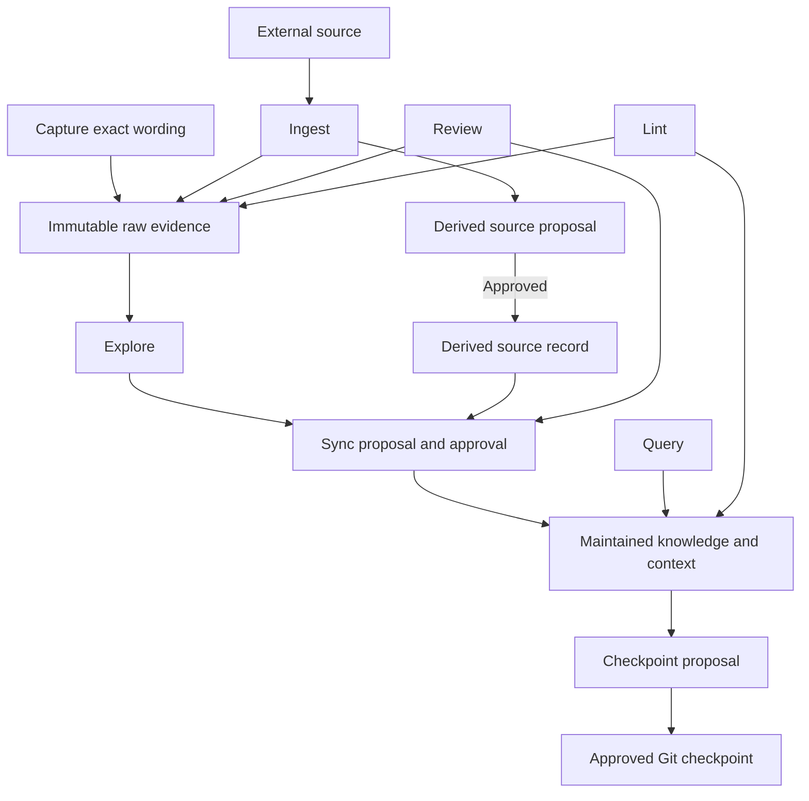

# Life Workspace

## Start

- [User Guide](../USER-GUIDE.md) — prompts, recipes, approval rules, search, and rollback.
- [Context Map](../CONTEXT-MAP.md) — route to the right domain.
- [Generated Brain Index](../Brain/INDEX.md) — find content; generated by CLI, not edited manually.
- [Brain Log](../Brain/LOG.md) — search the append-only operation timeline.
- [Brain Context](../Brain/CONTEXT.md) — current approved personal state and priorities.
- [Product Update Workflow](../PRODUCT-UPDATE-WORKFLOW.md) — how to propagate core changes between repos.

## Operating Loop

## Operations

| Preserve and develop | Use and maintain |
|---|---|
| [Capture](../USER-GUIDE.md#capture) · `/capture` | [Query](../USER-GUIDE.md#query) · `/query` |
| [Project Map](../USER-GUIDE.md#project-map) · `/project-map` | [Review](../USER-GUIDE.md#review) · `/review` |
| [Explore](../USER-GUIDE.md#explore) · `/explore` | [Lint](../USER-GUIDE.md#lint) · `/lint` |
| [Sync](../USER-GUIDE.md#sync) · `/sync` | [Checkpoint](../USER-GUIDE.md#checkpoint) · `/checkpoint` |
| [Ingest](../USER-GUIDE.md#ingest) · `/ingest` | |

## Safe Defaults

- Capture and explicit Ingest requests preserve raw input immediately.
- Derived source claims and warranted canonical integration require proposal and approval.
- Query, Review reports, and Lint are read-only.
- Sync requires approval before semantic writes.
- Checkpoint defaults to `propose`; it never commits implicitly.
- Git provides rollback; the Log provides operation search.
