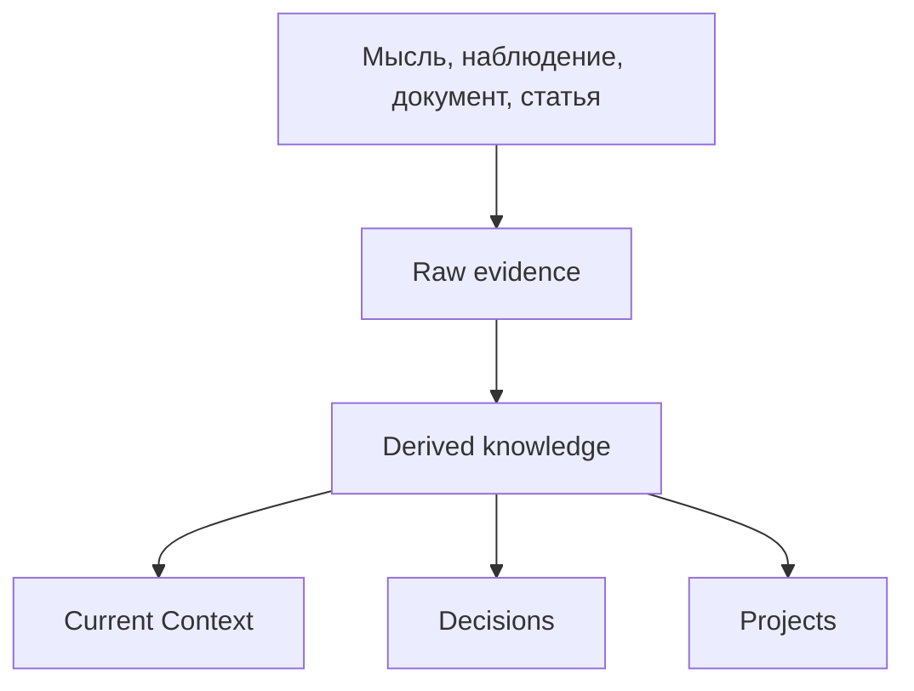
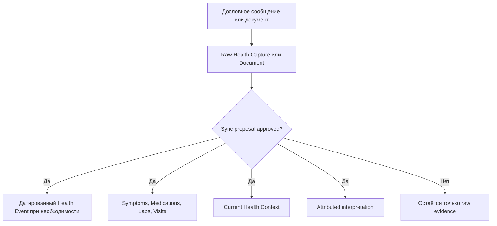
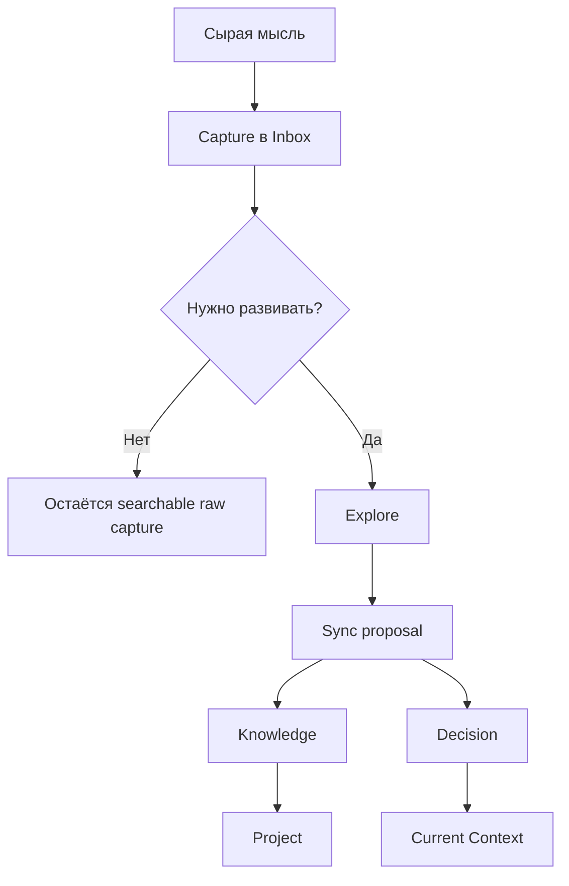
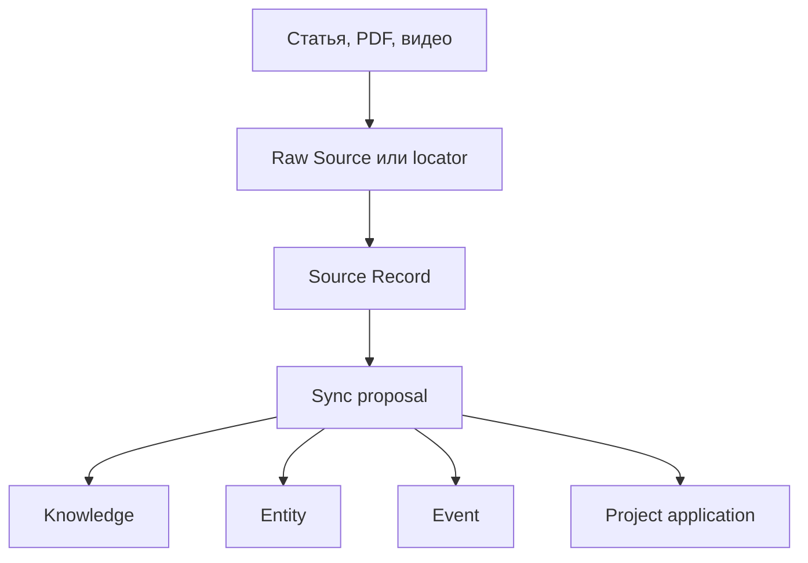
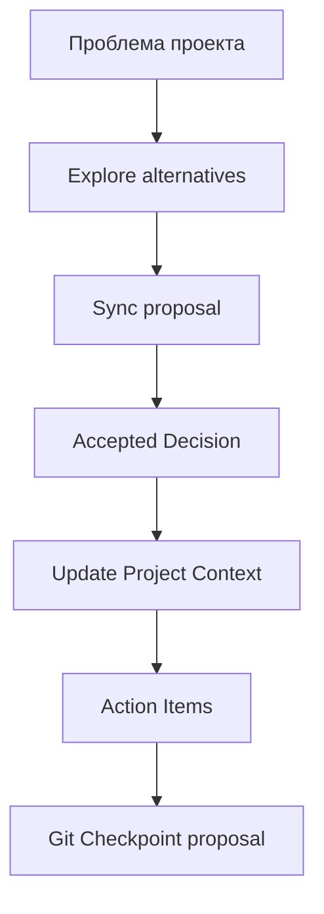

# Life Workspace — простое и полное объяснение

Life Workspace — это личная долговременная память в обычных Markdown-файлах, которую помогает обслуживать AI-агент.

Самая важная мысль:

> **Чат — это временный разговор. Brain — это то, что должно пережить разговор и остаться доступным через месяц или год.**

Система нужна не для сохранения каждого сообщения. Она нужна, чтобы:

- мгновенно не потерять мысль;
- постепенно развить её;
- отделить предположение от проверенного знания;
- запомнить принятое решение и его причины;
- поддерживать актуальный контекст жизни и проектов;
- сохранять внешние источники и понимать, какие выводы из них сделаны;
- находить всё это через агента, Index и обычный поиск;
- иметь историю изменений и возможность отката через Git.

Полное практическое руководство с командами находится в [USER-GUIDE.md](USER-GUIDE.md). Этот README объясняет **внутреннюю модель Brain: какие сущности существуют, чем они отличаются и как информация между ними перемещается**.

---

## Если совсем коротко

Представьте обычный рабочий стол:

- **Capture** — листок, на который вы дословно записали мысль, чтобы не забыть.
- **Knowledge** — поддерживаемая памятка о том, что мы считаем полезным знанием, почему и с какими ограничениями — от сырой гипотезы (`provisional`) до зрелой модели (`active`).
- **Decision** — запись «мы выбрали вот это, потому что…».
- **Context** — актуальная приборная панель: что сейчас происходит, что важно и какие ограничения действуют.
- **Event** — запись о том, что произошло в конкретное время.
- **Entity** — карточка устойчивого объекта: человека, организации, места, продукта, проекта или понятия.
- **Raw Source** — сохранённый оригинал или immutable locator manifest, который фиксирует URL и дату доступа; сам удалённый URL не становится неизменяемым.
- **Source Record** — разбор того, что утверждает конкретный источник.
- **Project** — отдельная рабочая область, объединяющая контекст, решения, статус и действия вокруг одной цели.
- **Index** — автоматически создаваемое оглавление Brain.
- **Log** — краткая история операций, выполненных над Brain.
- **Git** — машина времени для просмотра изменений и отката файлов.

Если не знаете, какую сущность выбрать, **не выбирайте**. Скажите агенту обычным языком, чего вы хотите добиться. Агент предложит подходящую форму, а смысловые изменения сначала покажет вам на approval.

## Первые пять минут

Все запросы пишутся в обычный чат с агентом. Slash-команды — только удобные сокращения.

1. **Сохраните простую мысль:**

   ```text
   /capture Это моя первая тестовая мысль.
   ```

   Обычный Capture попадёт в `Brain/Inbox/`. Явно медицинский Capture попадёт в `Brain/Health/Inbox/`. Исходный текст будет сохранён дословно.

2. **Спросите, что сохранилось:**

   ```text
   /query Что Brain знает о моей первой тестовой мысли?
   ```

3. **Если мысль нужно развить:**

   ```text
   /explore Что именно я имею в виду под этой мыслью?
   ```

4. **Если выводы нужно сделать долговременными:**

   ```text
   /sync
   ```

   Агент покажет proposal. Только ответы вроде `Одобряю всё` или `Одобряю пункты 1 и 3` разрешают предложенные semantic writes. Обычное `звучит хорошо` не считается approval.

5. **Проверьте результат** через `/query` или откройте [Brain Index](Brain/INDEX.md).

Этого достаточно, чтобы начать. Остальная часть README — подробный справочник.

---

# 1. Два разных типа вещей: записи и операции

Новому пользователю легко смешать две категории.

## Записи — это то, что хранится

Например:

- Capture;
- Knowledge;
- Decision;
- Context;
- Event;
- Entity;
- Source Record.

Это файлы или разделы файлов с долговременным содержанием.

## Операции — это то, что агент делает

Например:

- Capture — сохранить сырой текст;
- Project Map — вести большой проект через карту решений;
- Explore — помочь подумать;
- Sync — записать одобренные выводы;
- Ingest — обработать внешний источник;
- Query — ответить из Brain;
- Review — разобрать Inbox;
- Lint — проверить здоровье хранилища;
- Checkpoint — создать Git-точку возврата.

Название **Capture** используется и для операции, и для результата:

- операция Capture создаёт;
- запись Capture хранит.

Остальные операции обычно работают сразу с несколькими типами записей.

---

# 2. Главная архитектура: Raw и Derived

Вся информация делится на два принципиально разных слоя.



## Raw evidence — что именно было получено

Raw хранит исходный материал:

- точные слова пользователя;
- оригинальный файл;
- PDF, изображение или транскрипт;
- URL и дату доступа;
- лабораторный результат;
- исходное наблюдение.

Raw нельзя задним числом «улучшать» или переписывать. Если в исходной мысли была ошибка, она остаётся частью исторического свидетельства. Исправление хранится отдельно.

Важно:

> **Raw означает “сохранено без подмены”, а не “обязательно истинно”.**

Человек может ошибиться. Статья может ошибиться. Лабораторный результат может требовать интерпретации. Raw только честно сохраняет, что было сказано, получено или прочитано.

## Derived knowledge — что мы из этого понимаем

Derived — это поддерживаемая модель:

- Ideas;
- Knowledge;
- Decisions;
- Context;
- Events;
- Entities;
- Source Records;
- Project documents.

Derived-файлы можно обновлять, когда понимание меняется. Но они должны сохранять ссылки на происхождение и не выдавать интерпретацию за исходный факт.

## Что именно считается immutable

| Объект | Что нельзя переписывать | Что можно менять или добавлять |
|---|---|---|
| Capture | `Raw Capture` и каждый `Additional Raw Capture` | Non-semantic metadata; processing status и links — только когда они отражают уже одобренную processing action или semantic relationship |
| Raw Source manifest | Весь созданный manifest | Ничего; новая retrieval/version создаётся отдельным файлом |
| Raw Source artifact | Сохранённый original file | Ничего; новая версия хранится рядом отдельно |
| Внешний URL | Ничего: удалённая страница может измениться или исчезнуть | Локальный manifest только фиксирует URL, retrieval date и известные ограничения |
| Derived page | Не является immutable | Меняется после semantic proposal и approval; важное старое состояние помечается superseded, а не стирается молча |
| Log | Каждая уже записанная entry | Можно только дописывать новые entries и migration markers |

Immutability здесь — правило работы агента и append-only convention, а не защита файлов на уровне операционной системы. Git history помогает обнаруживать изменения, но текущий lint-снимок сам по себе не доказывает, что файл никогда не изменялся в прошлом.

---

# 3. Полный каталог сущностей

## 3.1 Capture — дословно сохранённый фрагмент

**Главный вопрос:** «Что именно я сказал или наблюдал?»

Capture нужен, когда вы хотите **быстро сохранить исходную формулировку**, не разбираясь, куда она относится.

Пример:

> «Мне кажется, что оптимизация игры может убивать интересные решения».

Команда:

```text
/capture Мне кажется, что оптимизация игры может убивать интересные решения.
```

Обычный Capture появляется в `Brain/Inbox/`. Если текст явно относится к здоровью, он сохраняется в `Brain/Health/Inbox/`, чтобы чувствительные данные не смешивались с обычным Inbox.

Capture:

- сохраняет точный текст;
- не проверяет, правда ли это;
- не делает мысль вашим окончательным убеждением;
- не требует выбрать тему, папку или тип знания;
- может навсегда остаться необработанным, если дальнейшая работа не нужна.

Агент может позже добавить metadata, status и ссылки, но раздел `Raw Capture` не переписывается.

Шаблон: [Templates/Capture.md](Templates/Capture.md).

### Когда использовать

- внезапная мысль;
- наблюдение;
- цитата из собственного разговора;
- короткая гипотеза;
- факт, который пока некогда разбирать;
- точное самонаблюдение;
- медицинское значение или симптом, который нужно сохранить без диагноза.

### Когда не использовать

Если вы уже приняли решение или хотите обновить текущий проектный state, нужен Sync, а не только Capture.

---

## 3.2 Project Map — карта большого проекта

**Главный вопрос:** «Какой путь через решения ведёт большой проект к нужному результату?»

Project Map используется для больших multi-session задач: геймдизайн от high-level систем до implementation plan, архитектурная переработка, длинный research/design roadmap или другой проект, который нельзя качественно закрыть одним разговором.

Обычно файл находится в `Projects/<Project>/PROJECT-MAP.md` и содержит:

- destination;
- decisions so far;
- current frontier;
- blocked questions;
- fog;
- out of scope;
- operating rules.

Карта проекта — это navigation layer, а не замена canonical specs. Она помогает выбрать следующий вопрос и не потерять зависимости. Когда вопрос даёт durable decision, результат всё равно записывается через Sync в project context, decision log, design spec или implementation plan.

Для пользователя это основной вход в большие проекты: можно сказать «продолжим карту проекта», а агент сам выберет, нужен ли мягкий Explore, жёсткий Grilling, research, prototype, task или Sync.

---

## 3.3 Explore Session — временная рабочая память обсуждения

**Главный вопрос:** «Как развивается наше размышление прямо сейчас?»

Explore Session создаётся операцией `/explore`. Это не transcript и не конечное знание. Она хранит структуру работы:

- цель обсуждения;
- текущее понимание;
- assumptions;
- ограничения;
- вопросы;
- provisional conclusions;
- нерешённые ветки.

Файлы находятся в `Brain/Sessions/`.

Пример:

```text
/explore Почему оптимизация может уменьшать пространство решений?
```

Session note может содержать сильный вывод, но сам факт его появления в session ещё не делает его принятым Knowledge или Decision. Для этого нужен Sync.

### Простая аналогия

- Session — доска в переговорной во время обсуждения.
- Knowledge — аккуратная памятка, созданная после обсуждения.
- Decision — подписанный итоговый выбор.

`temporary` означает **non-authoritative working state**, а не автоматическое удаление файла. Session может остаться в `Brain/Sessions/`, Index и Git history. После одобренного Sync она получает status `synced` и ссылки на resulting files. Удаление или архивирование Session не выполняется автоматически.

---

## 3.4 Knowledge — поддерживаемое переиспользуемое знание

**Главный вопрос:** «Что полезного мы сейчас считаем обоснованным, где это применимо и где ломается?»

Knowledge — не просто красивое резюме. Это поддерживаемая модель, которую можно использовать повторно в разных проектах и вопросах. Knowledge поглощает то, что раньше было отдельным типом Idea: ранняя, ещё недоказанная гипотеза — это просто Knowledge со статусом `provisional` или `developing` и низким `trust`, а не отдельная сущность.

Она должна отвечать:

- в чём принцип;
- на каких evidence он основан;
- насколько ему можно доверять;
- где он применим;
- какие у него ограничения;
- существуют ли counterexamples;
- когда его нужно пересмотреть;
- для каких проектов он полезен.

Файлы находятся в `Brain/Knowledge/`.

Пример зрелого Knowledge:

> «Если игра обещает фантазию постоянного роста силы, освоенный контент должен проходиться быстрее, а не только показывать увеличенные числа».

Пример провизорного Knowledge (то, что раньше называлось Idea):

> «Возможно, чрезмерная оптимизация соревновательных игр приводит к схождению всех стратегий к одному мета-решению».

Разница между ними — не тип файла, а статус и то, сколько evidence и scope уже собрано. Провизорная запись может развиваться, быть оспорена, получить доказательства, дорасти до `active`, или быть помечена `superseded`, если появилась лучшая модель.

Шаблон: [Templates/Knowledge.md](Templates/Knowledge.md).

### Knowledge не означает абсолютную истину

Knowledge может иметь status:

- `provisional` — сырая гипотеза, ещё не разобрана (раньше — отдельный тип Idea);
- `developing` — уже есть reasoning и assumptions, но evidence неполный;
- `active` — текущая рабочая модель;
- `disputed` — есть существенный спор или конфликт evidence;
- `superseded` — заменено более новой моделью;
- `archived` — больше не поддерживается как активное.

У него также есть trust level (`low`, `medium`, `high`, `established`) и temporal bounds. Низкий `trust` вместе со статусом `provisional`/`developing` — это ровно то, чем раньше была отдельная сущность Idea.

---

## 3.5 Decision — выбранный путь и его причины

**Главный вопрос:** «Что именно мы решили делать?»

Decision фиксирует выбор между альтернативами.

Пример:

> «Для Life Workspace используем checkpoint policy `propose`: агент предлагает commit, но не выполняет его без текущего approval».

Decision хранит:

- контекст проблемы;
- точную формулировку выбора;
- рассмотренные альтернативы;
- rationale;
- последствия;
- условия пересмотра;
- связанные Context и Project pages.

Решения хранятся в `Brain/Decisions/` или в проектном `Projects/<Project>/DECISIONS.md`.

Шаблон: [Templates/Decision.md](Templates/Decision.md).

### Почему недостаточно записать решение в Context

Context говорит, **что действует сейчас**.

Decision объясняет:

- почему это было выбрано;
- какие альтернативы отвергли;
- когда выбор стоит пересмотреть.

Без Decision через полгода будет видно текущее правило, но будет непонятно, откуда оно взялось.

### Статусы Decision

- `proposed` — предложено, но ещё не принято;
- `accepted` — принято и действует в своём scope;
- `rejected` — рассмотрено и отклонено;
- `deprecated` — больше не рекомендуется;
- `superseded` — заменено новым решением.

---

## 3.6 Context — актуальная модель текущего состояния

**Главный вопрос:** «Что сейчас считается действующим и важным?»

Context — это не история и не склад всех деталей. Это компактная актуальная приборная панель.

Context может описывать:

- текущие цели;
- current state;
- действующие ограничения;
- принятую терминологию;
- активные решения;
- открытые вопросы;
- ссылки на релевантные Knowledge и Sources.

В отличие от Event, Knowledge или Decision, Context — не растущая коллекция файлов. На каждый scope (общий, health, проект) существует ровно один актуальный `CONTEXT.md`, который перезаписывается по мере изменения state, а не накапливается как история.

Примеры:

- `Brain/CONTEXT.md` — общий личный контекст;
- `Brain/Health/CONTEXT.md` — текущий контекст health domain;
- `Projects/ExampleProject/CONTEXT.md` — текущее состояние проекта ExampleProject.

### Context не должен превращаться в

- дневник;
- transcript;
- список всех старых решений;
- детальную энциклопедию;
- бесконечный task list.

Когда state меняется, Context обновляется. Содержательные причины и evidence должны сохраняться в Decisions, Events и Source Records. Log показывает только факт операции и затронутые paths, а Git — фактический diff и версии; ни Log, ни Git автоматически не заменяют rationale решения.

Шаблон проекта: [Templates/Project-Context.md](Templates/Project-Context.md).

---

## 3.7 Event — что произошло во времени

**Главный вопрос:** «Что произошло, когда и на основании каких evidence?»

Event — это датированная реконструкция события.

Примеры:

- «14 июля был создан первый baseline commit Life Workspace»;
- «10 августа начался новый этап проекта»;
- «После обновления лекарства появился симптом»;
- «На встрече была согласована новая цель».

Events хранятся в `Brain/Events/` и могут ссылаться на:

- Captures;
- документы;
- Decisions;
- Entities;
- Projects;
- health evidence.

Шаблон: [Templates/Event.md](Templates/Event.md).

### Event и Capture — не одно и то же

Capture:

> «Сегодня после кофе болела голова».

Event:

> «14 июля пользователь сообщил о головной боли после кофе; причинная связь не установлена».

Capture сохраняет исходные слова. Event аккуратно организует доступные факты, время и uncertainty.

### Event и Context — не одно и то же

- Event: разовая датированная точка во времени, добавляется в растущую коллекцию `Brain/Events/`.
- Context: единственный актуальный снимок состояния на scope, перезаписывается, а не коллекция.

---

## 3.8 Entity — карточка устойчивого объекта

**Главный вопрос:** «Кто или что это такое, и какие знания к этому объекту относятся?»

Entity используется для объектов, которые:

- имеют самостоятельную идентичность;
- встречаются в нескольких местах;
- живут дольше одного разговора;
- заслуживают ссылок из разных Events, Projects, Sources и Knowledge pages.

Примеры Entity:

- человек;
- организация;
- место;
- продукт;
- книга;
- технология;
- устойчивое понятие;
- внешний проект.

Entities хранятся в `Brain/Entities/`.

Entity содержит:

- canonical name;
- aliases;
- краткое актуальное описание;
- известные facts с provenance;
- source claims;
- отношение или интерпретацию пользователя;
- timeline;
- связанные entities и projects;
- unresolved identity conflicts.

Шаблон: [Templates/Entity.md](Templates/Entity.md).

### Когда не нужна отдельная Entity

Не надо создавать карточку для каждого случайного существительного.

Новая Entity нужна, когда объект имеет собственный lifecycle и на него будут ссылаться из нескольких мест. Если объект упомянут один раз и не имеет самостоятельного значения, достаточно обычного текста или ссылки внутри существующей страницы.

### Entity и Knowledge — не одно и то же

- Entity отвечает: «Что такое X и что к нему относится?»
- Knowledge отвечает: «Какой принцип или модель мы считаем полезными и почему?»

Например:

- Entity `Vampire Survivors` — карточка конкретной игры.
- Knowledge `Освоенный контент как демонстрация роста силы` — общий игровой принцип, применимый к разным играм.

---

## 3.9 Raw Source — оригинал внешнего источника или его locator

**Главный вопрос:** «Откуда именно был получен материал?»

Raw Source хранится в `Brain/Sources/Raw/`.

Это может быть:

- локальный PDF;
- transcript;
- сохранённая веб-страница;
- изображение;
- текстовый snapshot;
- immutable locator manifest с URL и датой доступа.

Raw Source не содержит нашу интерпретацию. После создания он не редактируется. Для новой версии источника создаётся новый датированный artifact или manifest.

Шаблон: [Templates/Source-Raw.md](Templates/Source-Raw.md).

### Locator-only

Иногда полный материал нельзя или не нужно сохранять локально. Тогда manifest честно говорит:

- где находится источник;
- когда он был доступен;
- что полный snapshot не сохранён;
- какие ограничения остаются.

Это хуже полного snapshot для будущей проверки, но лучше, чем потерять provenance полностью.

---

## 3.10 Source Record — разбор конкретного внешнего источника

**Главный вопрос:** «Что утверждает именно этот автор или документ?»

Source Record хранится в `Brain/Sources/Records/` и ссылается на Raw Source.

Он отделяет:

- direct source claims;
- evidence и method;
- opinion автора;
- точные passages;
- limitations;
- user interpretation;
- agent inference;
- возможные применения.

Шаблон: [Templates/Source.md](Templates/Source.md).

### Ingest не означает согласие

Если вы попросили сохранить статью, это не значит, что Brain автоматически принимает все слова автора.

Source Record отвечает:

> «Автор утверждает X».

Knowledge может отвечать:

> «С учётом источника, опыта и ограничений мы используем принцип Y».

Decision может отвечать:

> «Для нашего проекта мы выбрали применить Y».

Это три разных уровня.

---

## 3.11 Project — рабочая область вокруг конкретной цели

**Главный вопрос:** «Что нужно знать и делать в рамках этой конкретной инициативы?»

Проекты находятся в `Projects/<Project-Name>/`.

Обычно проект содержит:

- `CONTEXT.md` — актуальное состояние;
- `DECISIONS.md` — принятые и предложенные решения;
- `STATUS.md` — текущий milestone и состояние работы;
- `ACTION-ITEMS.md` — следующие конкретные действия;
- дополнительные design/specification документы.

Project связывает между собой:

- общие Knowledge pages;
- Sources;
- Decisions;
- Events;
- Entities;
- внешние code repositories.

### Project Context и общий Knowledge

Если принцип полезен во многих проектах, он должен жить в `Brain/Knowledge/`, а проект должен на него ссылаться.

Если информация имеет смысл только внутри одного проекта, она может оставаться в `Projects/<Project>/`.

### Entity и Project — не одно и то же

- Project: у объекта есть конкретная цель или deliverable, и обычно ограниченный по времени жизненный цикл.
- Entity: устойчивый объект, который существует независимо от какой-либо цели пользователя, и может не иметь ни начала, ни конца.

Один и тот же объект может одновременно иметь Entity page (карточка объекта) и быть предметом отдельного Project (работа над ним) — это не противоречие.

---

## 3.12 Health Records — специальная чувствительная область

Health — не одна отдельная сущность, а домен с более строгими правилами.

Он находится в `Brain/Health/` и может включать:

- raw health captures;
- лабораторные результаты;
- visits;
- documents;
- medications;
- symptoms;
- health context;
- связанные Events и Entities.

Для Health нужно точно сохранять **все применимые данные, которые присутствуют в исходнике**:

- даты и время, если они известны;
- значения и units, если измерение было указано;
- reference ranges, если они присутствуют в лабораторном документе;
- название лекарства и dosage, если речь идёт о препарате;
- происхождение информации: user report, lab, clinician или document.

Отсутствие части полей не должно мешать немедленному Capture. Агент не должен додумывать время, значение, unit, range, диагноз или dosage.

Пример health flow:



- дословное сообщение сохраняется как raw health Capture;
- Event, Symptoms, Medications, Labs, Visits и Health Context являются derived semantic records и создаются или меняются только через approved Sync;
- конкретный датированный эпизод после approval может стать Event;
- текущие симптомы, лекарства, labs и visits после approval поддерживаются в соответствующих health records;
- актуальная одобренная сводка находится в Health Context;
- интерпретация всегда остаётся attributed и записывается только как approved derived write.

Агент не должен превращать симптом в диагноз или самостоятельно менять дозировку.

Health data нельзя бездумно включать в публичные репозитории, операции Log или внешние сервисы.

---

# 4. Самые важные различия

## Capture или Knowledge?

Используйте **Capture**, если нужно не потерять точные слова.

Используйте **Knowledge** (со статусом `provisional`, если мысль ещё сырая), если мысль уже стала самостоятельной гипотезой с reasoning, assumptions и open questions.

```text
Capture: «Кажется, игроки оптимизируют веселье из игры».
Knowledge (provisional): «Оптимизация может уменьшать пространство выразительных решений».
```

## Knowledge или Decision?

**Knowledge** говорит, как что-то обычно работает.

**Decision** говорит, что именно выбрали мы.

```text
Knowledge: «Частые checkpoints уменьшают размер возможного отката, но создают шум».
Decision: «После каждого Capture не коммитим; checkpoint предлагаем после крупных Sync и schema migrations».
```

## Decision или Context?

**Decision** хранит выбор и причины.

**Context** показывает уже действующее состояние.

```text
Decision: «Выбрали policy propose».
Context: «Текущая checkpoint policy — propose».
```

## Event или Context?

**Event** — разовая датированная точка во времени, одна запись в растущей коллекции `Brain/Events/`.

**Context** — единственный актуальный снимок состояния на scope, перезаписывается, а не накапливается.

```text
Event: «14 июля архитектура была обновлена».
Context: «Система использует raw/derived separation».
```

## Source Record или Knowledge?

**Source Record** представляет конкретный источник.

**Knowledge** синтезирует понимание, возможно из нескольких источников и опыта.

```text
Source Record: «Karpathy предлагает persistent LLM-maintained wiki».
Knowledge: «Для Life Workspace полезно разделять immutable evidence и поддерживаемую derived model».
```

## Entity или Project?

**Entity** — устойчивый объект без привязки к конкретной цели, может не иметь ни начала, ни конца.

**Project** — рабочая область вокруг конкретной цели или deliverable, обычно с ограниченным жизненным циклом.

Один проект может одновременно иметь Entity page, если на него нужно ссылаться как на объект из других областей. Но это не обязательно.

## Capture или Raw Source?

**Capture** сохраняет сообщение, мысль или наблюдение пользователя. **Raw Source** сохраняет внешний материал: статью, PDF, видео, transcript или locator manifest.

## Raw Source или Source Record?

**Raw Source** — evidence, которое нельзя переписывать. **Source Record** — редактируемый после approval разбор того, что это evidence сообщает.

## Knowledge или Context?

**Knowledge** — переиспользуемая модель, которая может быть полезна в разных ситуациях. **Context** — компактное актуальное состояние конкретной области или проекта прямо сейчас.

## Project или Project Context?

**Project** — вся рабочая область с несколькими документами, решениями и действиями. **Project Context** — один основной документ внутри Project, показывающий current agreed state.

## Health, Event или Context?

**Health** — чувствительный домен. Внутри него могут существовать разные типы записей: raw Capture, Event, Entity, maintained records и Context. Event отвечает «что произошло тогда», Health Context — «что считается актуальным сейчас».

---

# 5. Как информация проходит через Brain

## Путь обычной мысли



Не каждая Capture обязана пройти весь путь. Это нормально.

## Путь внешнего источника



Ingest источника не обязан создавать новую Knowledge page. Если источник не добавляет самостоятельного reusable knowledge, достаточно Source Record и явной отметки `Canonical pages: none needed`.

## Путь проектного решения



---

# 6. Операции: что просить у агента

| Операция | Простыми словами | Пишет файлы? | Нужен approval? |
|---|---|---:|---:|
| **Capture** | Сохрани мои точные слова | Да, raw capture | Запрос уже является разрешением |
| **Project Map** | Веди большой проект через карту решений | Да, map/ticket working artifacts | Запрос разрешает карту; canonical semantic changes — через Sync |
| **Explore** | Помоги мне это обдумать | Да, temporary session note | Запрос разрешает только session note |
| **Grilling** | Прожарь мой план/решение раундами вопросов | Нет, эфемерно | Ничего не пишет в Brain, пока не выполнен Sync |
| **Sync** | Запиши согласованные выводы в систему | Да, derived pages | Да, перед semantic writes |
| **Ingest** | Сохрани и разбери внешний источник | Raw сразу; derived после proposal | Для derived claims — да |
| **Query** | Ответь из того, что уже знает Brain | Нет | Нет |
| **Review** | Покажи, что накопилось в Inbox | Сначала нет | Для изменений — да |
| **Lint** | Проверь структуру и противоречия | Нет | Для последующих fixes — да |
| **Checkpoint** | Создай Git-точку возврата | Только после approval | Да, перед staging и commit |

## Capture

```text
/capture Сохранить точную мысль без обработки.
```

## Project Map

```text
/project-map Продолжить большой проект через карту решений, frontier и blocked/fog.
```

Project Map — рекомендуемый вход для больших проектов. Explore и Grilling остаются внутренними режимами: пользователь может просить их явно, но для длинного проекта обычно достаточно сказать «продолжим карту проекта».

## Explore

```text
/explore Разобрать идею, задавая по одному важному вопросу.
```

## Grilling

```text
/grilling Прожарить готовящийся план раундами вопросов без взаимных зависимостей.
```

В отличие от Explore (один вопрос за раз, мягкое многосессионное думание), Grilling задаёт целый батч независимых вопросов сразу (round/frontier), чтобы быстро сходиться к shared understanding по всему дереву решений и ничего не делать, пока оно не подтверждено. След от сессии остаётся только в том, что реально запишет последующий Sync — отдельной persistent-сущности для session у Grilling нет.

## Sync

```text
/sync Предложить, какие долговременные файлы изменить.
```

## Ingest

```text
/ingest https://example.com/article
```

## Query

```text
/query Что Brain знает о checkpoint policy?
```

## Review

```text
/review
```

## Lint

```text
/lint
```

## Checkpoint

```text
/checkpoint
```

Slash-команды не обязательны. Можно писать обычными фразами:

> Сохрани это дословно.

> Давай разберём эту идею.

> Предложи, как записать выводы в Brain.

> Что мы уже решили по этой теме?

---

# 7. Что агент делает сам, а где нужен человек

## Агент может сам

- выбрать filename;
- добавить действительно non-semantic metadata;
- найти существующую canonical page;
- не создавать дубликат при другой формулировке;
- поддержать link, если он только фиксирует уже одобренное отношение;
- сгенерировать Index;
- добавить bounded non-sensitive запись в Log после разрешённой операции;
- выполнить Query;
- подготовить Review или Lint report;
- предложить checkpoint scope и commit message.

## Пользователь должен подтвердить

- какую позицию он действительно принимает;
- какое решение принято;
- какую интерпретацию источника сохранить;
- добавлять ли link, который утверждает новое смысловое отношение;
- менять ли semantic status записи или текущий Context;
- объединять ли страницы;
- архивировать или удалять ли материал;
- считать ли старое знание superseded;
- выполнять ли Git commit;
- любую медицинскую интерпретацию.

Система автоматизирует bookkeeping, но не должна придумывать вашу позицию.

---

# 8. Статусы: почему файл не просто «есть или нет»

Статус показывает, как относиться к записи.

| Сущность | Типичные статусы | Что они означают |
|---|---|---|
| Capture | `unprocessed`, `partially-processed`, `processed` | Разобран ли сырой материал |
| Explore Session | `active`, `synced` | Идёт ли обсуждение и были ли его результаты синхронизированы; synced Session не удаляется автоматически |
| Raw Source | `immutable` | Manifest или artifact зафиксирован и не должен редактироваться |
| Knowledge | `provisional`, `developing`, `active`, `disputed`, `superseded`, `archived` | Насколько идея/модель развита, актуальна и есть ли серьёзные сомнения |
| Decision | `proposed`, `accepted`, `rejected`, `deprecated`, `superseded` | Был ли выбор принят и действует ли он |
| Entity | `active`, `inactive`, `historical`, `disputed` | Как сейчас трактуется сущность |
| Event | `recorded`, `disputed`, `superseded` | Насколько уверенно реконструировано событие |
| Source Record | `processing`, `ingested`, `archived` | Завершён ли разбор источника |
| Project | `planning`, `active`, `paused`, `completed`, `archived` | Текущее состояние проекта |

`superseded` обычно лучше удаления: старую модель можно увидеть и понять, почему она была заменена.

---

# 9. Как определяется, чему верить

В системе нет одного правила «новый файл всегда главнее старого».

Авторитет зависит от типа claim.

| Claim | Основной авторитет |
|---|---|
| Текущее предпочтение пользователя | Последняя явная attributable формулировка пользователя |
| Решение | Последнее approved Decision в нужном scope |
| Внешний факт | Качество, прямота, дата и method источника |
| Медицинская запись | Точный lab, clinician document или датированный user report |
| Интерпретация | Явно attributed user interpretation или approved synthesis |
| Agent inference | Только гипотеза агента, пока пользователь её не принял |

Index, Log и backlinks помогают найти информацию, но сами по себе не доказывают substantive claim.

---

# 10. Навигационные и служебные файлы

## `CONTEXT-MAP.md` — карта районов

[Context Map](CONTEXT-MAP.md) — маленький router. Он показывает основные области Brain, но не перечисляет каждый файл.

Аналогия: карта города.

## `Brain/INDEX.md` — полный каталог

[Brain Index](Brain/INDEX.md) генерируется командой:

```sh
python Tools/brain.py index
```

Он перечисляет navigable corpus pages, их типы, статусы и краткие описания.

Аналогия: библиотечный каталог.

Index нельзя редактировать вручную.

## `Brain/LOG.md` — история операций

[Brain Log](Brain/LOG.md) отвечает на вопрос:

> «Что происходило с хранилищем и когда?»

Он не должен содержать чувствительный payload. В нём допустимы:

- дата;
- operation type;
- короткий безопасный title;
- workspace-relative paths;
- одна bounded non-sensitive note.

Аналогия: журнал действий оператора.

## Git — история версий

Git отвечает на вопросы:

- что именно изменилось;
- какой файл выглядел раньше;
- когда появился конкретный текст;
- к какой версии можно вернуться.

Git не заменяет Index или Log:

- Index ищет содержание;
- Log ищет операции;
- Git показывает изменения и обеспечивает rollback.

## `Templates/` — формы документов

Шаблоны определяют рекомендуемую структуру сущностей. Обычно пользователю не нужно копировать их вручную: агент использует подходящий шаблон сам.

## `.agents/` и `Protocols/` — правила агента

Эти папки объясняют агенту:

- что читать;
- что можно писать автоматически;
- где нужен approval;
- как различать сущности;
- как выполнять Capture, Explore, Sync, Ingest, Query, Review, Lint и Checkpoint.

Это schema системы, а не пользовательские знания.

---

# 11. Структура папок

```text
Life Workspace repository/
├── README.md                         # Этот документ: модель и сущности
├── USER-GUIDE.md                     # Практические команды и recipes
├── CONTEXT-MAP.md                    # Маленький router по областям
├── Brain/
│   ├── CONTEXT.md                    # Общий текущий личный контекст
│   ├── INDEX.md                      # Автоматически созданный каталог
│   ├── LOG.md                        # Append-only журнал операций
│   ├── Inbox/                        # Raw Captures
│   ├── Sessions/                     # Временные Explore sessions
│   ├── Knowledge/                    # Переиспользуемое знание (включая провизорные гипотезы)
│   ├── Decisions/                    # Общие личные решения
│   ├── Entities/                     # Люди, организации, места, объекты, понятия
│   ├── Events/                       # Датированные события
│   ├── Sources/
│   │   ├── Raw/                      # Immutable originals и manifests
│   │   └── Records/                  # Derived source analysis
│   └── Health/                       # Чувствительные health records
├── Projects/
│   └── <Project-Name>/
│       ├── CONTEXT.md                # Текущее состояние проекта
│       ├── DECISIONS.md              # Проектные решения
│       ├── STATUS.md                 # Milestone и progress
│       └── ACTION-ITEMS.md           # Следующие действия
├── Learning/                         # ЭКСПЕРИМЕНТАЛЬНО: per-topic teach-рабочие области
│   └── <Topic>/                      # MISSION.md, reference/, learning-records/, lessons/, assets/, NOTES.md
├── Templates/                        # Шаблоны сущностей
├── Tools/                            # Локальная автоматизация
├── Dashboards/                       # Человеческая навигация
├── Protocols/                        # Основной системный контракт
└── .agents/                          # Skills, workflows и agent rules
```

Папка может оставаться пустой, пока соответствующие сущности не понадобились. Не нужно создавать Entity или Event только ради заполнения структуры.

---

# 12. Типовые пользовательские истории

## «У меня появилась мысль, и я не хочу её потерять»

```text
/capture <точный текст>
```

Результат: raw Capture. Больше ничего делать не обязательно.

## «Я хочу понять, хорошая ли это идея»

```text
/explore <тема>
```

Результат: structured discussion и temporary Session.

## «Мы пришли к важным выводам»

```text
/sync
```

Результат: proposal на Knowledge, Decision, Context или Project updates. Вы подтверждаете весь или часть scope.

## «Я принял конкретное решение»

> Запиши это как Decision и предложи, какой Context нужно обновить.

Результат: Decision сохраняет причины, Context — актуальное состояние.

## «Я нашёл статью или PDF»

```text
/ingest <URL или файл>
```

Результат: Raw Source, затем approved Source Record и только при необходимости Knowledge/Entity/Event/Project updates.

## «Что я уже думаю об этом?»

```text
/query <вопрос>
```

Результат: read-only ответ с citations и разделением durable state, source claims, user interpretation и agent inference.

## «В Inbox накопился мусор»

```text
/review
```

Результат: до десяти items с предложением действий. Ничего не удаляется автоматически.

## «Проверь, не развалился ли Brain»

```text
/lint
```

Результат: read-only structural и semantic report.

## «Хочу безопасную точку отката»

```text
/checkpoint
```

Результат: сначала proposal commit scope. Commit выполняется только после отдельного текущего approval.

---

# 13. Чего делать не нужно

- Не нужно вручную выбирать папку для каждой быстрой мысли.
- Не нужно превращать каждый Capture в Knowledge.
- Не нужно сохранять каждый разговор целиком.
- Не нужно создавать новую страницу при каждой переформулировке.
- Не нужно считать всё сохранённое истинным.
- Не нужно принимать слова источника как собственное убеждение.
- Не нужно вручную редактировать `Brain/INDEX.md`.
- Не нужно коммитить после каждой мелочи.
- Не нужно удалять старое знание только потому, что оно устарело: обычно лучше `superseded`.
- Не нужно разрешать агенту молча менять Decisions, Context или health interpretation.

---

# 14. С чего начать новому человеку

1. Прочитать этот README.
2. Открыть [USER-GUIDE.md](USER-GUIDE.md) и посмотреть готовые prompts.
3. Попробовать один Capture:

   ```text
   /capture Это моя первая тестовая мысль.
   ```

4. Задать Query:

   ```text
   /query Что Brain знает о своей архитектуре?
   ```

5. Провести небольшую Explore-сессию.
6. В конце попросить Sync и посмотреть proposal, не одобряя его автоматически.
7. Запустить `/review` и увидеть, как Capture предлагается преобразовать.
8. Запустить `/lint`.
9. После значимого изменения запросить `/checkpoint`.

Главное правило повседневного использования:

> **Хотите сохранить точные слова — Capture. Хотите подумать — Explore. Хотите изменить долговременную модель — Sync. Хотите прочитать Brain — Query.**

---

# 15. Быстрые ссылки

- [Практический User Guide](USER-GUIDE.md)
- [Home Dashboard](Dashboards/HOME.md)
- [Context Map](CONTEXT-MAP.md)
- [Generated Brain Index](Brain/INDEX.md)
- [Brain Operations Log](Brain/LOG.md)
- [Life Workspace Protocol](Protocols/Life-Workspace-Protocol.md)
- [Life Workspace Project Context](PRODUCT-UPDATE-WORKFLOW.md)

> [!WARNING]
> `Brain/Health/` может содержать чувствительные персональные данные. Включайте health files в Git checkpoints, публикацию или передачу внешним сервисам только осознанно.

---

# 16. Открытый исходный код: что переносимо, а что личное

Brain задуман так, чтобы общую часть можно было выложить отдельно от личных данных.

## Переносимо (общее, шарибельное)

- все `.agents/skills/*` — сами по себе не содержат личных данных;
- `Templates/`, `Tools/brain.py`, `Protocols/`;
- `README.md`, `USER-GUIDE.md`, `CONTEXT-MAP.md`;
- `Brain/Knowledge/`, если конкретные заметки написаны без личных подробностей.

## Личное (не для публикации без ревизии)

- `Brain/Health/` — всегда, см. предупреждение выше;
- `Brain/CONTEXT.md`, `Brain/Decisions/`, `Brain/Sessions/`, `Brain/Entities/`, `Brain/Events/`, `Brain/Sources/` — обычно содержат личный контекст;
- `Projects/<Project-Name>/` — рабочие области конкретных личных или коммерческих проектов;
- `Learning/<Topic>/` — личные учебные материалы.

Это простой список путей, не отдельная система тегов или метаданных — при форке достаточно не копировать личные папки.

## Ограничение: одна активная сессия

Brain спроектирован для **одной активной агентской сессии за раз**. `sync-brain` не использует precondition-хэши или блокировки файлов: одновременная работа нескольких агентов/сессий над одним workspace может привести к потерянным правкам без предупреждения. Если вы форкаете Brain для мультиагентного или командного использования, добавьте свой механизм конкурентного доступа (advisory locks, precondition hashes) поверх текущего `sync-brain` — из коробки это не поддерживается.
