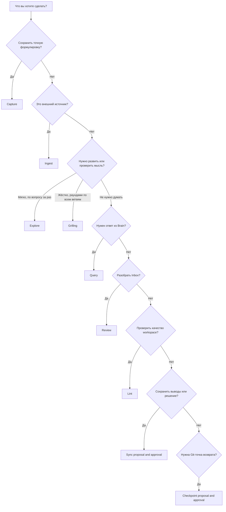

# Руководство пользователя Life Workspace

Life Workspace — это личная база знаний в обычных Markdown-файлах. Чат помогает думать, но не считается долговременной памятью. Важное становится durable knowledge только после записи в Brain.

Быстрая навигация: [README](README.md) · [Home](Dashboards/HOME.md) · [Context Map](CONTEXT-MAP.md) · [сгенерированный Index](Brain/INDEX.md) · [Operations Log](Brain/LOG.md)

## Короткая модель

В системе есть три слоя:

1. **Raw evidence** — дословные мысли, исходники и locator manifests. Они сохраняются как свидетельство и не переписываются.
2. **Derived knowledge** — идеи, знания, решения, сущности, события, source records и текущие project contexts. Этот слой можно уточнять, связывать и помечать устаревшим.
3. **Operations** — Capture, Project Map, Explore, Sync, Ingest, Query, Review, Lint и Checkpoint. Они определяют, как информация проходит между raw и derived слоями.

[Index](Brain/INDEX.md) — генерируемый CLI каталог содержимого. Его не нужно редактировать вручную. [Log](Brain/LOG.md) — краткая append-only история операций без чувствительного содержания. Если формат Log меняется, новая схема начинается с migration marker, а старые entries не переписываются. Git хранит версии файлов и служит механизмом rollback.

## Операции одним взглядом

| Операция | Для чего | Нужен input пользователя | Что происходит автоматически | Когда нужен approval | Alias |
|---|---|---|---|---|---|
| **Capture** | Немедленно сохранить исходную формулировку | Текст, выделение или однозначно названный фрагмент | Дословная запись, лёгкие metadata, проверка явного дубля, служебные index/log updates | Повторный approval не нужен: просьба сохранить уже является разрешением | `/capture` |
| **Project Map** | Вести большой multi-session проект от тумана до specs и implementation plan | Название/цель проекта, существующие записи и ответы на intake-вопросы | Markdown-карта: destination, decisions so far, frontier, blocked, fog, out of scope; агент сам роутит в Explore/Grilling/Research/Prototype/Task/Sync | Для самой карты достаточно явного запроса; canonical semantic changes — только через Sync | `/project-map` |
| **Explore** | Развить или проверить мысль | Тема и ответы на несколько важных вопросов | Загрузка узкого контекста и временная session note, не полный transcript | Для разговора не нужен; для durable changes нужен последующий Sync | `/explore` |
| **Sync** | Превратить выводы в durable knowledge | Текущий разговор, session/capture или явно названные выводы | Поиск canonical pages, proposal, затем links/index/log maintenance после записи | **Всегда до semantic writes**; можно одобрить только часть proposal | `/sync` |
| **Ingest** | Сохранить и разобрать внешний источник | URL, файл, PDF, transcript или вставленный текст | Явный запрос автоматически разрешает сохранить raw artifact или locator manifest и retrieval metadata | Claims derived source record требуют proposal и явного approval; canonical pages создаются или меняются только когда они действительно нужны и одобрены | `/ingest` |
| **Query** | Получить ответ из Brain | Вопрос | Узкий поиск через Context Map и Index, ответ с citations | Не нужен: операция read-only | `/query` |
| **Review** | Разобрать накопившийся Inbox | Можно без аргументов или с областью/темой | Пакет до 10 items, группировка и рекомендации | Отчёт — без approval; promote/archive/delete/merge и другие changes — только после approval | `/review` |
| **Lint** | Проверить структуру и semantic drift | Обычно не нужен; можно задать scope | Детерминированный lint и read-only semantic checks | Отчёт — без approval; исправления выполняются отдельно через Sync | `/lint` |
| **Checkpoint** | Создать Git-точку возврата | Причина или scope; для commit — явное текущее согласие | По умолчанию только status/diff и предложение commit scope/message | **Всегда перед staging и commit**; default policy — `propose` | `/checkpoint` |

Slash aliases — сокращения, а не отдельный язык. Те же действия можно попросить обычной фразой.

Вы редко вызываете skill по имени — и это нормально, агент сам определяет нужную операцию по контексту. Для больших проектов основной пользовательский вход — Project Map / «карта проекта»; Explore и Grilling обычно становятся внутренними режимами внутри конкретного frontier-вопроса, а не отдельным выбором, который нужно помнить. Каждый раз, когда агент использует один из skills Brain, он открывает ответ коротким тегом `[skill: <name>]`, чтобы всегда было понятно, какая именно операция сейчас применяется.

## Capture

Используйте Capture, когда важнее всего **не потерять формулировку**.

### Как сохранить мысль дословно

Скажите:

> Сохрани это дословно: «Оптимизация игры может убивать интересные решения».

или:

```text
/capture Оптимизация игры может убивать интересные решения.
```

Текст под `Raw Capture` сохраняется в исходном языке и после первой записи считается immutable. Агент может добавить или исправить metadata, status и links вокруг payload, но не «улучшает» сам текст. Если позже вы уточните мысль, исходник останется, а уточнение будет отдельным dated addition или derived page.

Capture не требует от вас выбирать папку, тип знания или теги. Агент сам добавляет минимальные metadata и задаёт вопрос только тогда, когда непонятно, **что именно** сохранять.

### Что Capture не делает

Capture не превращает фрагмент автоматически в факт, решение или проверенное знание. Сырая мысль может быть ошибочной, эмоциональной или незавершённой — именно поэтому она остаётся raw evidence.

## Project Map

Project Map / «карта проекта» — основной workflow для больших задач, которые не помещаются в одну сессию: геймдизайн от high-level систем до implementation plan, крупная архитектурная переработка, длинный research/design roadmap или многоэтапный creative project.

Natural language:

> Давай заведём карту проекта для новой игры и разберём её от high-level дизайна до implementation plan.

Alias:

```text
/project-map
```

Агент начинает с короткого intake: что должно быть готово в конце, какие входные материалы уже существуют, на какой стадии проект и нужен ли мягкий или жёсткий режим. Если задача действительно большая, он создаёт или обновляет `Projects/<Project>/PROJECT-MAP.md`.

Карта проекта содержит:

- **Destination** — что считается концом этого разбора;
- **Decisions so far** — уже закрытые решения со ссылками на specs/decision records;
- **Current frontier** — открытые, незаблокированные вопросы;
- **Blocked** — реальные вопросы, зависящие от prerequisites;
- **Fog** — важные, но ещё слишком мутные области;
- **Out of scope** — сознательно исключённое из текущего прохода.

После этого пользователь может просто говорить:

```text
Продолжим карту проекта.
```

Агент сам выберет следующий frontier-вопрос или спросит, если есть несколько равных вариантов. Внутри он может использовать мягкий Explore, жёсткий Grilling, research/code audit, rough prototype или task checklist. Пользователю не нужно выбирать между этими режимами вручную.

Project Map не заменяет canonical specs. Когда frontier-вопрос приводит к durable design decision, изменению project context или implementation plan, агент предлагает Sync и записывает только одобренные semantic changes.

## Explore

Explore нужен, когда мысль ещё не готова к фиксации как durable state. Для больших проектов обычно не выбирайте Explore вручную: начните с Project Map, а агент использует Explore как внутренний режим для fuzzy frontier-вопросов.

Natural language:

> Давай разовьём идею о том, что системная оптимизация снижает разнообразие игровых решений.

Alias:

```text
/explore Как сохранить разнообразие билдов без искусственных ограничений?
```

Агент найдёт только релевантный контекст, кратко покажет найденное и будет задавать по одному важному вопросу. Он проверит термины, assumptions, alternatives, trade-offs, contradictions и counterexamples. Временная session note хранит структуру обсуждения, а не полный transcript.

Explore **не меняет durable knowledge сам по себе**. В конце вы получите current understanding, сильные выводы, открытые вопросы, риски и возможные изменения Brain. Если выводы стоит сохранить, переходите к Sync.

## Grilling

Grilling нужен, когда план или решение уже почти сформированы и их нужно жёстко проверить по всем ветвям сразу, а не по одному вопросу за раз. В больших проектах Grilling обычно является внутренним режимом Project Map для sharp frontier-вопросов.

Natural language:

> Прожарь меня по этому плану, пока мы не согласуемся по всем важным точкам.

Alias:

```text
/grilling
```

Агент строит design tree и ведёт его **раундами**: каждый раунд — это все вопросы текущего frontier (без взаимных зависимостей), каждый вопрос — с рекомендованным ответом агента. Факты ищет агент сам (через инструменты или sub-agent), решения — только ваши. Сессия эфемерна: агент ничего не пишет в Brain, пока frontier не пуст и вы явно не подтвердите shared understanding — после этого выводы фиксируются через Sync.

Если нужен более мягкий режим — один вопрос за раз, с адаптацией под ответ — это Explore.

## Sync

Sync — явная граница между «мы поговорили» и «Brain теперь считает это долговременным состоянием».

Natural language:

> Предложи, как сохранить выводы этого разговора в Brain.

Alias:

```text
/sync
```

### Как сделать из разговора durable knowledge

1. Обсудите тему напрямую, через Project Map или через Explore.
2. Попросите Sync.
3. Агент найдёт существующие canonical pages, чтобы не плодить дубли.
4. Агент покажет компактный proposal: какие files создать/обновить, какие claims добавить, что пометить superseded и какие links провести.
5. Ответьте, например: «Одобряю всё», «Только пункты 1 и 3» или «Не меняй project context».
6. Агент применит только одобренный scope, затем выполнит безопасное service maintenance: links, generated Index, non-sensitive Log entry и metadata.

Общий разговор, согласие с аргументом или фраза «звучит хорошо» не считаются approval на durable writes. Approval относится к текущему конкретному proposal.

## Ingest

Ingest используется для статей, книг, PDF, papers, videos, podcasts, transcripts и других внешних источников.

Natural language:

> Инжестни эту статью. Меня интересуют архитектурные принципы и ограничения: https://example.com/article

Alias:

```text
/ingest https://example.com/article
```

Обычный flow:

1. Проверить, доступен ли источник. Если нет — не притворяться, что он прочитан.
2. По явному запросу Ingest автоматически сохранить raw material либо immutable locator manifest. Для `locator-only` явно зафиксировать, что полный snapshot не сохранён. Отдельный повторный approval для raw preservation не нужен.
3. Подготовить proposal для derived source record: какие claims, evidence, author opinions, limitations и provenance будут записаны. Создать или обновить record только после явного approval.
4. В approved record отделить direct source claims, evidence, author opinion, user interpretation и agent inference.
5. Обсудить, что вы принимаете, отвергаете или хотите применить.
6. Предлагать reusable Knowledge, Entity, Event или Project Context только если материал действительно оправдывает самостоятельную canonical page или обновление существующей. Ingest не обязан производить canonical output.
7. Создать или изменить такие canonical pages только в одобренном scope; отсутствие подходящего canonical output является нормальным результатом Ingest.

Комментарии под статьёй или gist не становятся словами автора. Они могут быть отдельными источниками только при явном ingest.

## Query

Query отвечает на вопросы из durable Brain и ничего не записывает.

Natural language:

> Что Brain знает о нашей политике Git checkpoints? Покажи решение и ограничения.

Alias:

```text
/query Какие выводы по архитектуре Life Workspace уже приняты?
```

Query сначала использует [Context Map](CONTEXT-MAP.md) как router, затем [Index](Brain/INDEX.md) как каталог и читает только релевантные pages. В ответе material claims сопровождаются Markdown citations. Durable state, source claims, user interpretation и новая agent inference должны быть отделены друг от друга.

### Как искать

- **Смысловой вопрос:** попросите Query обычным языком.
- **Точное слово или фраза:** скажите «найди точную фразу …»; тогда можно проверить raw captures и source artifacts.
- **По теме или проекту:** укажите scope: «в ExampleProject», «только health facts», «по knowledge management».
- **По недавним операциям:** смотрите [Log](Brain/LOG.md), затем переходите к затронутым files.
- **Вручную:** начните с [Index](Brain/INDEX.md); он генерируется CLI и указывает на canonical pages.

Index и Log помогают навигации, но не являются substantive evidence. Для фактов Query цитирует реальную context, decision, knowledge или source page.

### Правила Operations Log

[Log](Brain/LOG.md) остаётся короткой append-only timeline, а не вторым transcript:

- заголовок entry содержит дату, operation type и короткое non-sensitive название;
- при необходимости допускается одна bounded note с operational result, но не payload, подробное reasoning или чувствительное содержание;
- affected paths указываются только относительно корня workspace, например `Brain/Sources/Records/example.md`; абсолютные OS paths и home-directory paths не записываются;
- существующие entries не переписываются; исправление или дополнительный context оформляются новой entry.

## Review

Review — Inbox-oriented разбор накопившихся captures, а не автоматическая перепись всего Brain.

Natural language:

> Покажи, что накопилось в Inbox по игровому дизайну, и предложи действия.

Alias:

```text
/review
```

По умолчанию агент показывает до 10 items, объединяет очевидные кластеры и предлагает одно действие: promote, update canonical, attach to project, record decision, leave unprocessed, archive или delete. Raw payload не переписывается и ничего не удаляется автоматически. После вашего выбора изменения применяются по правилам Sync.

## Lint

Lint проверяет здоровье workspace и всегда остаётся read-only.

Natural language:

> Проверь Brain на broken links, смешение raw/derived и устаревшие claims.

Alias:

```text
/lint
```

Сначала запускается deterministic CLI lint, затем выполняются targeted semantic checks: дубли canonical pages, orphan links, stale claims, contradictions, provenance gaps, нарушения raw immutability, утечки catalogue detail в Context Map и чувствительный content в Log.

Lint только сообщает findings. Чтобы исправить их, попросите Sync; semantic fixes потребуют approval.

## Checkpoint

Checkpoint — контролируемая Git-точка возврата после значимого завершённого изменения. Это не замена Log и не автоматический commit.

Natural language:

> Предложи Git checkpoint для одобренного обновления архитектуры.

Alias:

```text
/checkpoint
```

Default mode — `propose`: агент читает Git status/diff и показывает подходящий scope, исключения, риски и commit message. Он не выполняет `git add` или `git commit`, пока вы явно не одобрите **текущее** предложение.

Если уже staged хотя бы один unrelated path, Checkpoint останавливается и сообщает о конфликте scope. Агент не продолжает commit и не делает `git restore --staged`, `git reset` или другое unstaging пользовательской работы.

Checkpoint уместен после high-impact Sync, завершённого ingest, schema migration или большого approved Review batch. Он не нужен после каждой быстрой мысли, Query или мелкой правки.

### Как откатываться

1. Найдите операцию по дате и типу в [Log](Brain/LOG.md).
2. Найдите ближайший checkpoint в Git history (`git log --oneline`).
3. Сначала посмотрите изменения (`git show <commit>` или diff нужных paths).
4. Попросите агента предложить безопасный rollback с точным scope.
5. Явно одобрите восстановление только выбранных files.

Пример:

> Покажи, что изменилось после checkpoint `abc1234`, и предложи вернуть только project context. Не трогай остальные незакоммиченные изменения.

Git — источник version history и rollback. Log — поисковая timeline операций. Ни Checkpoint, ни rollback не должны скрыто стирать незакоммиченную работу, делать reset/clean или переписывать history.

## Когда нужен пользовательский input

Система автоматизирует bookkeeping, но не должна выдумывать вашу позицию.

**Input нужен**, когда:

- неизвестен payload Capture или источник Ingest;
- Explore дошёл до выбора между реальными alternatives;
- нужно решить, какие conclusions считать durable;
- Sync предлагает semantic writes;
- Review предлагает merge/archive/delete/promote;
- нужно выбрать scope fixes после Lint;
- Checkpoint должен перейти от proposal к commit;
- источник недоступен, а без текста нельзя честно извлечь claims.

**Input обычно не нужен**, чтобы:

- выбрать filename и минимальные metadata для Capture;
- найти существующую canonical page;
- добавить безопасные links и non-sensitive Log entry после approved write;
- сгенерировать Index через CLI;
- получить read-only Query, Review report или Lint report;
- получить Checkpoint proposal без commit.

## Recipes

### 1. Быстрая мысль

> Сохрани дословно: «Не всякая эффективность улучшает игру».

Или:

```text
/capture Не всякая эффективность улучшает игру.
```

Результат: immutable raw capture в Inbox. Никакого интервью и превращения в «истину».

### 2. Развить мысль

> Давай исследуем, когда оптимизация действительно уменьшает пространство интересных решений. Задавай по одному вопросу.

Или:

```text
/explore Когда оптимизация уменьшает пространство решений?
```

Результат: structured discussion и temporary session note. Durable pages пока не меняются.

### 3. Сохранить выводы разговора

> Предложи Sync: сохрани основной принцип как Knowledge со status `active`, а нерешённые вопросы оставь как Knowledge со status `provisional`. Сначала покажи proposal.

```text
/sync
```

Результат: proposal → ваше выборочное approval → canonical durable updates.

### 4. Ingest статьи

> Инжестни статью по URL. Сохрани provenance, отдели claims автора от моей интерпретации и не используй комментарии как слова автора.

```text
/ingest https://example.com/article
```

Результат: raw artifact или locator manifest сохраняется сразу; затем вы получаете proposal для derived source claims. После approval может появиться source record, а canonical knowledge или project updates создаются только при отдельной необходимости и в одобренном scope.

### 5. Спросить Brain

> Что Brain знает о raw/derived separation? Отдели принятые решения от claims внешних источников и дай ссылки.

```text
/query Что принято по raw/derived separation?
```

Результат: read-only ответ с citations и явной uncertainty.

### 6. Обработать Inbox

> Покажи до 10 необработанных captures, сгруппируй дубли и предложи по одному действию. Ничего пока не меняй.

```text
/review
```

Результат: review report. После выбора — approved Sync actions без изменения raw payloads.

### 7. Health fact

> Сохрани как health fact дословно: «14 июля 2026, температура 37,8 °C в 21:10».

```text
/capture 14 июля 2026, температура 37,8 °C в 21:10.
```

Результат: raw health capture с точными date, time, value и unit. Capture не ставит диагноз и не меняет dosage. Интерпретация, если нужна, обсуждается отдельно и сохраняется только через approved Sync.

### 8. Project decision

> Мы выбираем policy `checkpoint: propose` для Life Workspace. Предложи запись решения и обновление current context, но сначала покажи diff-like proposal.

```text
/sync
```

Результат: approved Decision + актуальный Project Context; rationale и consequences не теряются в chat history.

### 9. Maintenance

> Запусти полный lint Brain. Отдельно покажи deterministic failures и semantic findings; ничего не исправляй.

```text
/lint
```

После отчёта:

> Предложи Sync только для broken links. Semantic conflicts пока не меняй.

### 10. Git checkpoint

> Архитектурный Sync завершён. Предложи checkpoint, исключи health data и unrelated changes. Не коммить без моего следующего подтверждения.

```text
/checkpoint
```

Результат: proposal. Commit появляется только после явного текущего approval; при unrelated staged paths операция останавливается, не снимая их со staging.

## Decision tree



Полезная последовательность для сложной темы: **Capture → Explore → Sync → Checkpoint**. Не все шаги обязательны: готовое явное решение можно сразу провести через Sync, а внешний источник — через Ingest и затем Sync только для его durable applications.

## Экспериментальные возможности (trial)

Эти возможности взяты на пробу и будут явно пересмотрены на следующей итерации правки Brain (см. Open follow-ups в [Brain/CONTEXT.md](Brain/CONTEXT.md)):

- **`teach`** — обучение пользователя теме или навыку через несколько сессий. Alias: `/teach`. Рабочая область каждой темы — отдельная папка в `Learning/<Тема>/`.
- **`Learning/`** — новая верхнеуровневая папка для этих рабочих областей. Если не будет реально использоваться — будет удалена.

## Anti-patterns

- **«Сохрани разговор целиком как знание».** Transcript содержит шум и отвергнутые варианты. Лучше Capture для точной цитаты или Sync для выводов.
- **Использовать Capture как автоматическое подтверждение истины.** Capture сохраняет evidence, а не проверяет claim.
- **Просить Explore и ожидать скрытых durable edits.** Explore думает; Sync записывает после approval.
- **Создавать новую page при каждой переформулировке.** Сначала ищется canonical page; новая нужна только самостоятельному concept/entity с отдельным lifecycle.
- **Редактировать raw payload или source snapshot задним числом.** Исправления добавляются рядом или отражаются в derived layer.
- **Смешивать слова автора, комментарии, user interpretation и agent inference.** У каждого слоя должна быть явная attribution.
- **Считать Index или Log доказательством claim.** Это навигация и operation history, а не substantive source.
- **Редактировать [Index](Brain/INDEX.md) вручную.** Он генерируется CLI.
- **Запускать Review как безусловное «почисти всё».** Сначала read-only batch и recommendations, потом выбор пользователя.
- **Ожидать, что Lint сам всё исправит.** Lint только проверяет; fixes идут через Sync.
- **Коммитить после каждой мелочи.** Checkpoint нужен на meaningful boundary, а не как ритуал.
- **Путать Log и Git.** Log отвечает «какая операция была», Git — «какая версия файлов была».
- **Делать rollback через broad reset/clean.** Сначала inspect, затем точный scope и защита unrelated work.
- **Сохранять чувствительные payloads или абсолютные paths в Log.** Используйте короткое non-sensitive название, при необходимости одну bounded note и только workspace-relative affected paths.
